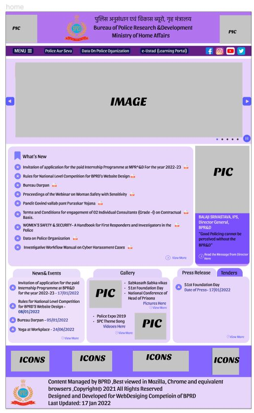
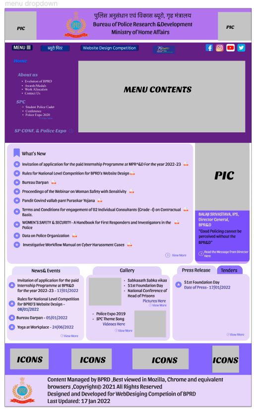
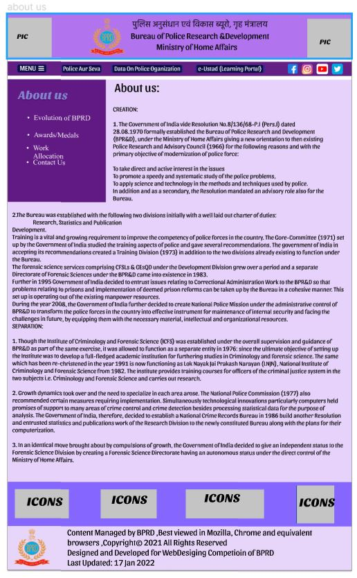
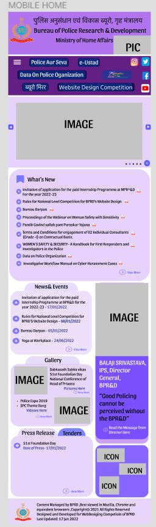
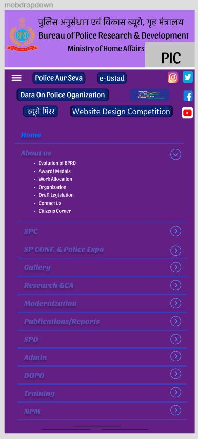

# Wire frame for a website

## AIM:
To design a wire frame for a website.

## DESIGN STEPS:

### Step 1:
Used Figma for the wire frame 

### Step 2:
Changed the allignment and design of the given existing website.

## OUTPUT:
### PC Home screen:

### PC Menu dropdown:

### PC About us page:

### Mobile Home:

### Mobile Menu dropdown:

## Result:
Thus a wire frame is designed for a given website.
